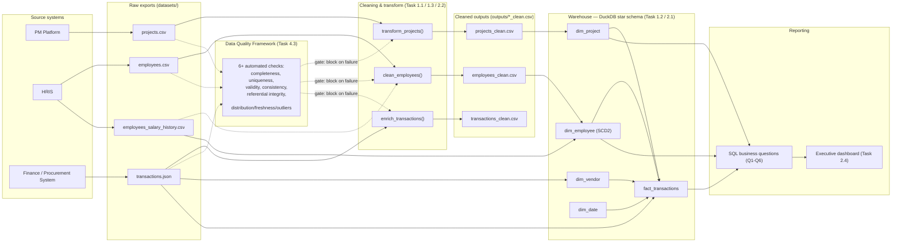

# Presight Data Governance Document

**Author:** maryamalshehhi
**Scope:** `projects`, `employees`, `transactions`, `employees_salary_history`
**Pillar 4, Task 4.2**

---

## Section 1 — Data Inventory

| Dataset | Source system | Format | Update frequency | Volume estimate | Daily growth |
|---|---|---|---|---|---|
| `projects` | Project management platform (PM system of record) | CSV export | Daily batch export | ~500 rows today | ~1-3 new/changed projects per day at current org size |
| `employees` | HRIS (Human Resources Information System) | CSV export | Daily batch export (HR is system of record; this is a downstream copy) | ~1,000 rows today | ~1-5 hires/changes per day |
| `transactions` | Finance / procurement system | JSON export (API-style batch) | Multiple times daily (transactional system) | ~50,000 rows today | ~150-300 new transactions/day at current volume |
| `employees_salary_history` | HRIS payroll/compensation module | CSV export | On every compensation change event (hire, raise, promotion) | ~1,800 rows today (~60% of workforce has ≥1 change on record) | ~5-15 new rows/day (raises, promotions, new hires) |

All four are currently **batch exports** landing as flat files, not live database connections — the warehouse (Task 1.2/2.1) is rebuilt from these snapshots rather than streaming continuously. `transactions` is the highest-velocity source and the first candidate for a real streaming feed (see Pillar 3's Kafka work), since finance/procurement events happen continuously during business hours.

---

## Section 2 — Data Classification

Classification legend: **Public** (shareable externally) · **Internal** (internal-only, no regulatory trigger) · **Confidential** (sensitive business data) · **Personal (PII)** (identifies a natural person — regulatory obligations apply).

### `projects`

| Column | Classification | Notes |
|---|---|---|
| `project_id` | Internal | Internal identifier, not identifying on its own |
| `project_name` | Internal | May reference client/initiative names |
| `department` | Internal | Org metadata |
| `status`, `status_category`, `priority`, `risk_level` | Internal | Derived/operational metadata |
| `region` | Internal | Business geography |
| `start_date`, `end_date`, `duration_days` | Internal | Scheduling data |
| `budget`, `actual_cost`, `budget_variance`, `budget_utilisation_pct`, `is_over_budget` | **Confidential** | Financial performance data — competitively sensitive |
| `project_manager_id` | Internal (references a person) | The ID itself is internal, but it links this record into an identified person's activity — see `employees` |

### `employees`

| Column | Classification | Regulation (if PII) | Notes |
|---|---|---|---|
| `employee_id` | Internal | — | Internal key; becomes identifying once joined to `full_name` |
| `full_name` | **Personal (PII)** | GDPR + UAE PDPL | Direct identifier |
| `email` | **Personal (PII)** | GDPR + UAE PDPL | Direct identifier / contact data |
| `hire_date` | **Personal (PII)** | GDPR + UAE PDPL | Employment history is personal data under both regimes |
| `department`, `role`, `level`, `region` | Internal | — | Organisational metadata; becomes part of a personal data record once joined to name/ID, but not identifying standalone |
| `manager_id` | Internal | — | References another employee's ID |
| `status` | Internal | — | Active/Inactive employment flag |
| `years_experience` | Internal | — | Low-sensitivity, but personal when attributed |
| `salary` | **Personal (PII) + Confidential** | GDPR + UAE PDPL | The single most sensitive column in this dataset — both a business secret and regulated personal financial data |

### `transactions`

| Column | Classification | Notes |
|---|---|---|
| `transaction_id`, `invoice_ref` | Internal | Internal references |
| `project_id` | Internal | Links to `projects` |
| `vendor_id`, `vendor_name` | **Confidential** | Third-party commercial relationships — vendor pricing/volume is competitively sensitive |
| `category`, `currency`, `payment_status` | Internal | Operational metadata |
| `amount` | **Confidential** | Financial data |
| `transaction_date` | Internal | — |
| `approved_by` | Internal (references a person) | Employee ID reference, same treatment as `project_manager_id` above |
| `notes` | **Confidential** | Free text — treated as confidential by default since free-text fields can inadvertently contain names, amounts, or other sensitive detail no schema constraint prevents |

### `employees_salary_history`

| Column | Classification | Regulation (if PII) | Notes |
|---|---|---|---|
| `employee_id` | Internal | — | Links to `employees` |
| `previous_salary`, `new_salary` | **Personal (PII) + Confidential** | GDPR + UAE PDPL | Historical compensation tied to an identified individual — arguably the most sensitive column in the entire warehouse, since it reveals a trajectory over time, not just a snapshot |
| `previous_role`, `new_role`, `previous_level`, `new_level` | Internal | — | Becomes personal data once joined to `employee_id` + name |
| `effective_date` | Internal | — | |
| `change_type` | Internal | — | Hire / Raise / Promotion |
| `change_reason` | **Confidential** | — | Free-text HR narrative; can contain sensitive performance commentary |

---

## Section 3 — Data Ownership

| Dataset | Data Owner (role) | Data Steward (role) | Access approver |
|---|---|---|---|
| `projects` | Head of PMO | Data Engineering Lead | Department Head of the requesting team |
| `employees` | Head of HR | HRIS Administrator | HR Director |
| `transactions` | Head of Finance | Finance Data Analyst | Finance Director |
| `employees_salary_history` | Head of HR (Compensation & Benefits) | Compensation & Benefits Lead | **Joint approval:** HR Director + Finance Director |

**Owner vs. Steward, in my own words:** the **Owner** is the accountable business executive — they decide *why* the data exists, who is allowed to see it, and what "good" looks like for it, and they are the person who answers for it in an audit or a breach. The **Steward** is the operational custodian who actually *does* the day-to-day work of keeping that promise: fixing data quality issues, administering access requests the Owner has approved, and maintaining the pipeline/schema. The Owner sets policy; the Steward executes and maintains it day to day. A useful test: if a regulator or an executive asks "who is accountable for this data being right and properly protected," that's the Owner; if an engineer asks "who do I ask about a weird null value in this column," that's the Steward.

---

## Section 4 — Retention Policy

| Dataset | Retention period | Justification | Disposal method | Enforced by |
|---|---|---|---|---|
| `projects` | Active life + 7 years after closure | UAE Commercial Companies Law and FTA tax record-keeping expectations align around a 5-year minimum for business records tied to financial transactions; 7 years gives headroom for multi-year audits/disputes on large projects | Archive to cold storage at closure + 1 year, hard-delete after year 7 unless under litigation hold | Data Engineering (automated archival job) + PMO Data Steward (exception approval) |
| `employees` | Duration of employment + 2 years after termination | UAE Labour Law limitation periods for labour-related claims are commonly cited around 1-2 years after end of service; 2 years covers that window plus normal reference-check needs | Anonymise (strip name/email/contact fields, keep aggregate HR analytics fields) rather than hard-delete, so historical headcount/attrition reporting isn't broken | HR Data Steward |
| `transactions` | 5 years from transaction date | UAE Federal Tax Authority requires VAT-relevant financial records to be retained for 5 years | Archive to cold storage after 2 years (still queryable but off the hot warehouse), delete after year 5 | Finance Data Steward |
| `employees_salary_history` | Duration of employment + **7 years** after termination — **longer than `employees`, deliberately** | **Special consideration, as flagged in the task:** gratuity (end-of-service benefit) calculations under UAE Labour Law depend on an employee's full salary progression, and disputes over gratuity/back-pay can surface years after termination; salary data also has to reconcile against WPS (Wage Protection System) filings and prior tax-year records. A 2-year window (matching plain `employees` retention) is not sufficient here — the retention driver is financial/compensation dispute exposure and regulatory reconciliation, not general HR reference-check needs | Archive (not delete) at termination + 2 years into a restricted-access cold store; hard-delete only after year 7 and only with sign-off from both HR Director and Finance Director (matching the joint-approval ownership above) | HR Data Steward, with Finance sign-off required before any deletion |

---

## Section 5 — Access Control

Access levels: `None` · `Read` · `Read + Write` · `Full (including delete)`

| Persona | Projects | Employees | Transactions | Salary History |
|---|---|---|---|---|
| Data Engineer | Read + Write | Read + Write | Read + Write | **Read** |
| BI Analyst | Read | Read | Read | **None** |
| Finance Team | Read | None | Read + Write | **Read** |
| HR Team | None | Read + Write | None | **Read + Write** |
| Executive | Read | Read | Read | **None** |

**Justification (principle of least privilege):**
- **Data Engineer** gets Read+Write on the operational datasets because they build and run the pipeline, but only **Read** on salary history — an engineer needs to see salary values to build/validate the SCD2 model (Task 1.2), but has no legitimate reason to directly edit compensation records; that write path belongs to HR's own system, not the analytics pipeline.
- **BI Analyst** and **Executive** get `None` on salary history. Both roles are served by *aggregate* compensation reporting (e.g., "average salary by department" or "total comp spend"), which can be built as a rolled-up view without ever exposing row-level salary-to-individual mappings. Standing row-level access isn't justified by either role's normal job function; if a specific analysis genuinely needs it, that should be a time-boxed, logged, individually-approved exception — not default access.
- **Finance Team** gets `Read` on salary history because payroll disbursement, gratuity calculation, and WPS filing are Finance functions that genuinely require it — but not `Write`, since compensation *decisions* belong to HR; Finance consumes the data, it doesn't originate it.
- **HR Team** gets `None` on `projects` and `transactions` — project delivery and vendor payments are outside HR's function, and giving blanket access "just in case" is exactly the anti-pattern least-privilege is meant to prevent.
- Nobody outside HR and Finance sees salary history at all, and nobody gets `Full (including delete)` on any of these four tables through standing role-based access — deletion only happens through the governed retention/disposal process in Section 4, never through ad hoc user access.

---

## Section 6 — Data Lineage

**Where transformations happen:** entirely in the Task 1.1/1.3/2.2 Python pipelines (`transform_projects`, `clean_employees`, `enrich_transactions`) — the warehouse load (Task 1.2/2.1 SQL) is a straight `read_csv_auto`/`read_json_auto` load of already-cleaned data plus the SCD2 versioning logic for `dim_employee`, not a place where new business-rule transformation is introduced.

**Where quality checks are applied:** the Task 4.3 framework runs against the **raw** sources before transformation (so issues are caught before they propagate into the warehouse), and acts as an explicit gate in the Airflow DAG (Task 3.3) — `validate_data_quality` must pass before `transform_and_enrich` is allowed to run. `employees_salary_history` feeds `dim_employee` directly (dashed line above) rather than through its own `_clean.csv`, since its only consumer today is the SCD2 build, not a standalone report.
